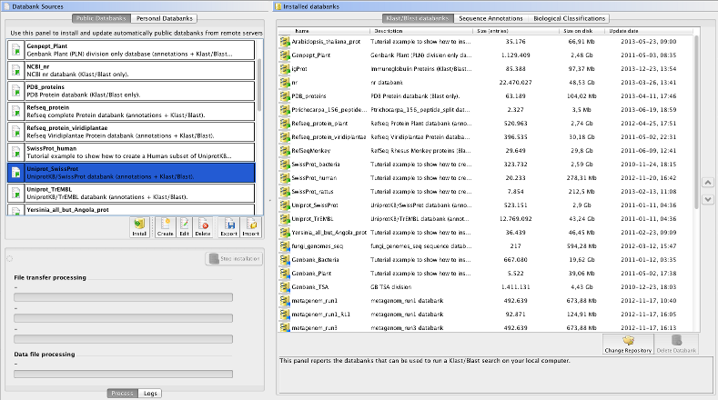

# *BeeDeeM*: the Bioinformatics Databank Manager System 

 [](https://www.gnu.org/licenses/agpl-3.0.txt) [](http://www.oracle.com/technetwork/java/javase/downloads/index.html) []() [](https://bio.tools/beedeem) [](https://anaconda.org/sebimer/beedeem) [](https://hub.docker.com/repository/docker/sebimer/beedeem/general) [](https://data-dataref.ifremer.fr/bioinfo/ifremer/sebimer/tools/ORSON/)


*BeeDeeM* is a general purpose **B**ioinformatics **D**atabank **M**anager. 

It provides a suite of command-line and UI softwares to manage and use major sequence databanks and biological classifications. It is the ideal companion of the [NCBI BLAST suite of softwares](https://pgdurand.gitbooks.io/beedeem/test_install.html#run-a-blast-search) and [PLAST](https://plast.inria.fr/), as well as tools such as [ORSON](https://gitlab.ifremer.fr/bioinfo/workflows/orson) annotation pipeline, [BLAST Viewer](https://github.com/pgdurand/BlastViewer) platform.

## Main features

*BeeDeeM* automatically performs:

* the download of the database files from remote sites \(via FTP, HTTP or Aspera\),
* the decompression of the files \(gzip files\),
* the un-archiving of the files \(tar files\),
* the conversion of native sequence banks \(e.g. Genbank\) to FASTA files,
* the preparation of databases in BLAST format from native sequence bank formats,
° the preparation of other indexes such as Diamond, Bowtie, Hisat, etc.
* the indexing of Genbank, Refseq, Embl, Genpept, Swissprot, TrEmbl and Fasta files allowing their efficient querying by way of sequence identifiers,
* the indexing of sequence features and ontologies data (NCBI Taxonomy, Gene Ontology, Enzyme Commission, Intepro domains and PFAM domains),
* the preparation of taxonomic subsets out of annotated sequence banks,
* the filtering of sequence banks with user-defined constraints.

[More](https://pgdurand.gitbooks.io/beedeem/).

## Main tools

*BeeDeeM* provides a toolchain made of:

* a **command-line tool to automate databanks installation**
* a **UI front-end to do the same in a more friendly way** (see below)
* a **command-line tool to annotate BLAST results**
* a **command-line to query databanks using sequence IDs**

[More](https://pgdurand.gitbooks.io/beedeem/).

### Use BeeDeeM from the command line

Here is an example of a script to start Genbank_CoreNucleotide installation on Ifremer's [DATARMOR supercomputer](https://www.top500.org/system/178981):

```
#!/usr/bin/env bash
#PBS -q web
#PBS -l mem=4gb
#PBS -l ncpus=8
#PBS -l walltime=72:00:00

# Release of BeeDeeM to use
BDM_HOME="$SOFT/bioinfo/beedeem"
BDM_VER="4.7.1"

# Load BeeDeeM environment
module load java/1.8.0_121

# prefix of '.dsc' file that must exist in $BDM_HOME/conf/descriptor
DESCRIPTOR="Genbank_CoreNucleotide"
export KL_LOG_FILE=${DESCRIPTOR}.log
$BDM_HOME/$BDM_VER/install.sh \
   -desc ${DESCRIPTOR} \
   >& "$HOME/beedeem/logs/${DESCRIPTOR}-pbs.out"
```

You can easily automate bank installation using such BeeDeeM based scripts with Unix cron scheduler.

### Use BeeDeeM UI

In addition to use BeeDeeM from the command-line, the software also comes with a friendly interface:



## Practical use cases

Among others, these databanks can be used to:

* prepare and maintain up-to-date local copy of usefull data
* run BLAST, Diamond or PLAST sequence comparison jobs
* annotate BLAST, Diamond or PLAST results with sequence features and ontologies

## Companion tools

*BeeDeeM* features and data are accessible from:

* [ORSON nextflow pipeline](https://github.com/ifremer-bioinformatics/orson)
* [BioDocument Viewer](https://github.com/pgdurand/BioDocumentViewer)
* [BLAST Viewer](https://github.com/pgdurand/BlastViewer)
* [BLAST Filter Tool](https://github.com/pgdurand/BLAST-Filter-Tool)
* [Plealog Bioinformatics Core API](https://github.com/pgdurand/Bioinformatics-Core-API)


[This manual](https://pgdurand.gitbooks.io/beedeem/) explains how to install, configure and use *BeeDeeM*.

## Requirements

Use a [Java Virtual Machine](http://www.oracle.com/technetwork/java/javase/downloads/index.html) 1.8 (or above) from Oracle. 

*Not tested with any other JVM providers but Oracle... so there is no guarantee that the software will work as expected if not using Oracle's JVM.* [More](https://pgdurand.gitbooks.io/beedeem/) about *BeeDeeM* requirements.

## Software installation, use and configuration

* [BeeDeeM manual on GitBook](https://pgdurand.gitbooks.io/beedeem/)

## License and dependencies

*BeeDeeM* itself is released under the GNU Affero General Public License, Version 3.0. [AGPL](https://www.gnu.org/licenses/agpl-3.0.txt)

It depends on several thrid-party libraries as stated in the NOTICE.txt file provided with this project.

----
(c) 2003-2023 - Patrick G. Durand; BeeDeeM development started in early 2003 by the development of [Core API](https://github.com/pgdurand/Bioinformatics-Core-API) for [BLAST Viewer](https://github.com/pgdurand/BlastViewer)... a long, long story by now! ;-) 
